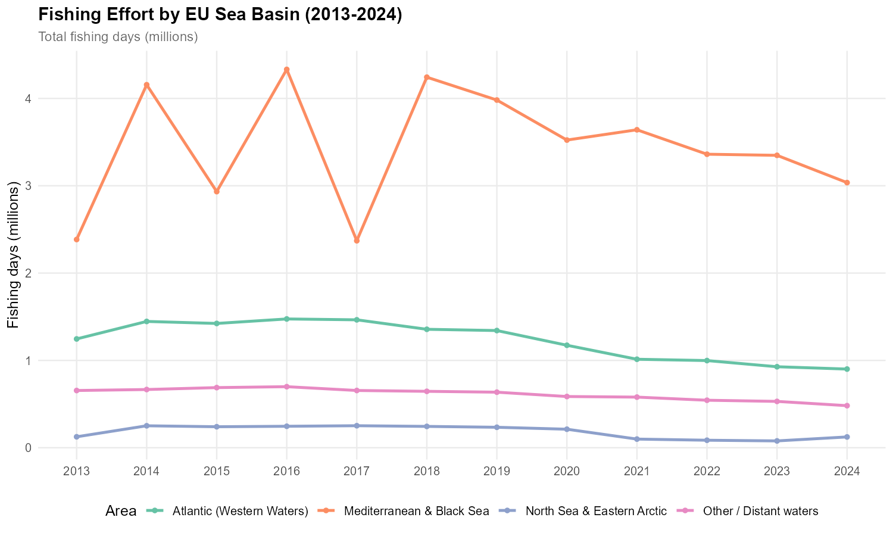
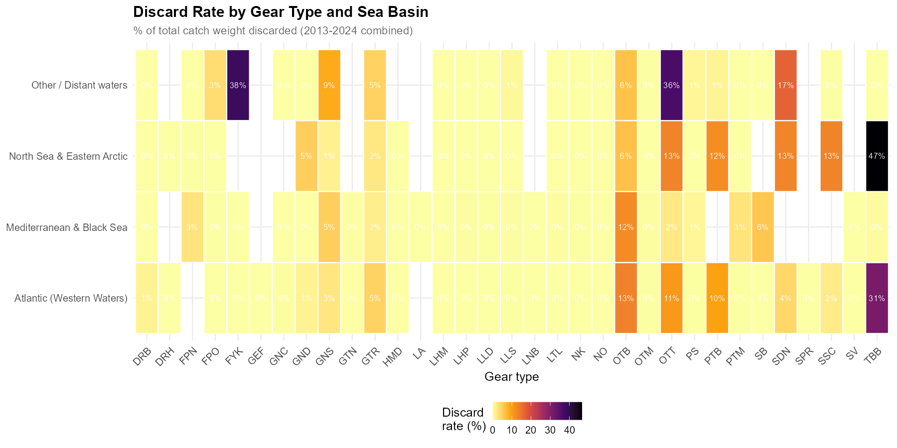
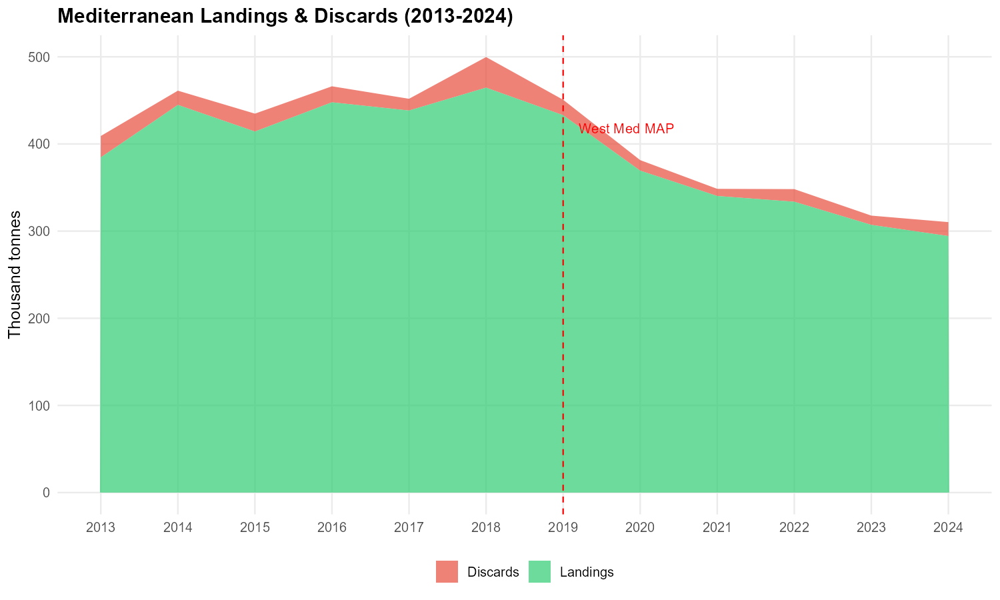
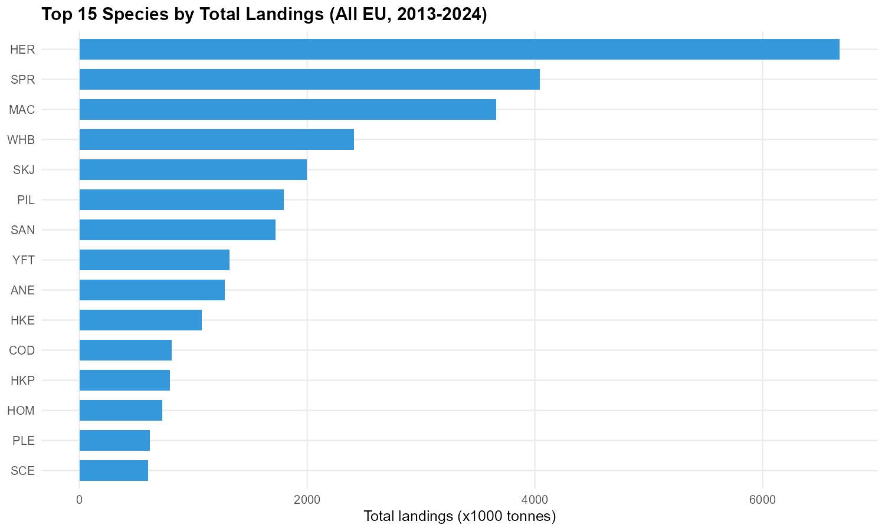

# EU FDI Explorer


**Fishing Effort, Landings, Discards & Fleet Adaptation across European Sea Basins (2013–2024)**

An interactive R Markdown analysis of the EU Fisheries Dependent Information (FDI) dataset — the most comprehensive publicly available record of European fishing activity. Built as a self-contained HTML report with drill-down charts, linked filters, and a data playground for self-service exploration.

---

## What This Project Does

This notebook takes 12 years of EU fisheries data (nearly 5 million catch records across 23 Member States) and answers three questions:

1. **How has fishing activity changed across European sea basins?**
   Effort and landings trends by area, gear type, and country — with the Mediterranean as a deep-dive case study and Greek waters as a focal point.

2. **Did the Landing Obligation actually reduce discards?**
   Species-level discard rate analysis linked to the phased LO implementation (2015–2019), with before/after comparisons for key species like hake, red mullet, Nephrops, and sole. Includes an exemption analysis using official STECF EWG 25-10 data — interactive treemaps and country comparisons showing where de minimis and high survivability exemptions allow discards to persist under full compliance.

3. **Have fleets adapted their fishing strategies in response to regulation?**
   Unsupervised machine learning (PCA + clustering) applied to fleet métier compositions to detect behavioural shifts — which countries changed what they target, and when?

---

## Why This Matters for Policy

The EU Common Fisheries Policy is at a critical juncture. FMSY targets became legally binding in 2025, the Landing Obligation has been fully implemented since 2019, and the Western Mediterranean MAP is driving effort reductions for trawlers. Yet policymakers, Advisory Councils, and Regional Coordination Groups often lack accessible, interactive tools to explore the underlying data.

This notebook addresses that gap:

- **For DG MARE and STECF:** An interactive complement to the static tables in EWG reports. The same FDI data, but explorable by area, species, gear, and country — with policy milestones annotated directly on the trends.

- **For the CFP evaluation process:** The 2026 CFP review requires evidence on whether the Landing Obligation reduced discards. This notebook provides species-level before/after analysis across all sea basins, contextualised against the exemptions that remain in force — extending the CINEA 2021 study with 5 additional years of data (2020–2024).

- **For Advisory Councils and Member States:** Self-service exploration via the pivot table playground and linked filters. A Mediterranean AC member can filter to their GSA and species of interest; a North Sea stakeholder can do the same. No R knowledge required.

- **For transparency:** The confidentiality diagnostics section makes visible what is usually hidden — which countries report openly and where data gaps exist. This supports the ongoing discussion on improving FDI data quality and completeness.

The analysis is reproducible and built entirely on publicly available data. It can be updated annually when the new FDI data call results are published.

---

## Interactive Features

The report is a single self-contained HTML file. All interactivity runs in the browser — no server, no R installation needed to view it.

- **Drill-down charts** (Highcharter) — click an area to see its species breakdown, click a species to see its geographic distribution
- **Linked filters** (Crosstalk) — select a country, gear, or species in the sidebar and all plots + tables update in sync
- **Sunburst diagrams** (Plotly) — explore the hierarchy of area, gear type, and species for landings and discards
- **Treemap** (Plotly) — exemption type, species, and country in a zoomable hierarchy, sized by discard volume
- **Animated timelines** (echarts4r) — watch how gear-type rankings shift year by year
- **Interactive heatmaps** (ggiraph) — hover over any cell to see exact discard rates by gear and region
- **Searchable tables** (Reactable) — grouped, sortable, filterable data tables throughout
- **Pivot table playground** (rpivotTable) — drag and drop any dimension to create your own views of the data

---

## Data

All data comes from the **STECF FDI public dissemination** (2025 data call, EWG 25-10), freely available at:
https://stecf.ec.europa.eu/data-dissemination/fdi_en

Three data sources are used:

| Dataset | Scope | Records |
|---------|-------|---------|
| FDI Catches by country (Table A) | Landings weight/value, discards by species | ~5M rows |
| FDI Effort by country (Table G) | Fishing days, kW-days, GT-days by métier | ~366K rows |
| STECF EWG 25-10 Annex 3 | LO exemption discard rates by species, gear, country, area | ~930 rows across 5 sea basins |

Confidential values (marked as `C` by Member States) were converted to NA — never to zero. Approximately 43% of numeric values are suppressed. The report includes a transparency section showing confidentiality rates by country, variable, and area.

**No confidential or non-public data is used.** All analysis is reproducible from the publicly available download.

---

## Key Findings

- **Effort trends:** Fishing effort has declined across most EU sea basins over 2013–2024. The Mediterranean shows a notable drop post-2019, coinciding with the West Med MAP trawler effort limits.
- **Species composition:** The top landed species EU-wide are sprat (SPR), herring (HER), and sandeel (SAN) in the Atlantic; hake (HKE), sardine (PIL), and anchovy (ANE) dominate Mediterranean catches.
- **Discard rates:** The EU-wide discard rate is ~4.6% of total catch weight. Bottom trawls (OTB) generate the bulk of discards; passive gears (gillnets, longlines) have near-zero discard rates.
- **Landing Obligation impact:** Discard rates show modest declines in some areas post-LO, but the effect is uneven. Before/after analysis for key Mediterranean species (hake, red mullet, Nephrops) reveals persistent discarding alongside broad exemptions.
- **Exemption analysis:** 736 active exemption entries across 5 EU sea basins — de minimis and high survivability exemptions cover a substantial share of catches, particularly for Mediterranean trawl fisheries.
- **Fleet adaptation:** PCA + clustering of métier profiles reveals that most Mediterranean countries maintained their fleet identity (gear mix) over 12 years. Shifts, where detected, are gradual and may reflect reporting changes rather than genuine fleet adaptation.
- **Data transparency:** ~43% of numeric values are confidential (`C`) — this varies significantly by country and area, disproportionately affecting smaller countries and niche fisheries.

<p align="center">
  
  
</p>
<p align="center">
  
  
</p>

---

## Technical Stack

| Component | Tools |
|-----------|-------|
| Language | R (R Markdown) |
| Data wrangling | data.table, dplyr, janitor |
| Static plots | ggplot2, ggpubr, patchwork, viridis |
| Interactive plots | plotly, highcharter, ggiraph, echarts4r |
| Tables | reactable, DT |
| Linked filtering | crosstalk |
| Clustering | cluster, vegan |
| Output | Self-contained HTML (code folded, floating TOC) |

---

## Project Structure

```
eu-fdi-explorer/
├── fdi_explorer.Rmd          # Main notebook
├── fdi_explorer.html         # Rendered interactive report
├── R/
│   ├── helpers.R             # Theme, palettes, area grouping, utilities
│   └── prepare_data.R        # Raw CSVs → aggregated .rds files
├── data/
│   ├── raw/                  # STECF CSVs + EWG Annex (not included — download from STECF)
│   └── processed/            # Aggregated .rds files (included)
│       ├── catches_by_area_year_gear_species.rds
│       ├── effort_by_area_year_gear.rds
│       ├── effort_eu_by_area_year_gear.rds
│       ├── effort_by_country_year_metier.rds
│       ├── conf_diagnostics.rds
│       └── lo_exemptions.rds
├── figures/                  # Preview images for this README
├── .gitignore
└── LICENSE
```

---

## How to Reproduce

1. **View the report:** Open `fdi_explorer.html` in any browser. The HTML is fully self-contained — all data, JavaScript libraries, and styles are embedded. No R installation or server needed.

2. **Re-knit from source:**
   ```r
   # Install packages (one-time)
   install.packages("pacman")
   pacman::p_load(tidyverse, data.table, janitor, plotly, highcharter,
                  ggiraph, echarts4r, reactable, DT, crosstalk,
                  cluster, vegan, patchwork,
                  ggpubr, ggrepel, viridisLite, paletteer, pals,
                  scales, htmltools)

   # Knit
   rmarkdown::render("fdi_explorer.Rmd")
   ```

3. **Rebuild from raw data (optional):**
   - Download the FDI ZIP from [STECF](https://stecf.ec.europa.eu/data-dissemination/fdi_en)
   - Download the EWG 25-10 Annex 3 exemptions xlsx from the [STECF FDI reports page](https://stecf.ec.europa.eu/reports/fisheries-dependent-information-reports_en)
   - Place the `Catches/` and `Effort/` subfolders + the Annex xlsx in `data/raw/`
   - Run `source("R/prepare_data.R")`
   - Then knit as above

---

## Policy Context

The analysis is framed around three major EU fisheries policy milestones:

| Year | Policy | Impact |
|------|--------|--------|
| 2015 | Landing Obligation begins | Pelagic species must be landed, not discarded |
| 2017–2019 | LO phased in for demersals | Hake, red mullet, sole, Nephrops progressively covered |
| 2019 | West Med MAP | Trawl effort caps in Western Mediterranean |
| 2019 | Full LO implementation | All TAC species (Atlantic) + all MCRS species (Med) |
| 2019–present | Exemptions in force | De minimis (hake, sole, whiting) + high survivability (Nephrops, plaice, skates) allow some discards to continue legally |
| 2025 | FMSY legally binding | Maximum sustainable yield targets become mandatory |

Key exemptions remain in force (high survivability for Nephrops in pots, de minimis for hake and sole in trawls) — the analysis accounts for these when interpreting discard trends.

**Reference:** CINEA (2021) *Synthesis of the landing obligation measures and discard rates.* DOI: 10.2826/176808

---

## Data Citation

STECF (2025). Fisheries Dependent Information — FDI data dissemination. 2025 data call (EWG 25-10). European Commission, Joint Research Centre. https://stecf.ec.europa.eu/data-dissemination/fdi_en

STECF EWG 25-10 (2025). Evaluation of Fisheries Dependent Information (FDI) for EU Fleets — Annex 3: Exemptions. https://stecf.ec.europa.eu/reports/fisheries-dependent-information-reports_en

CINEA (2021). Synthesis of the landing obligation measures and discard rates. ISBN 978-92-9460-565-8, DOI 10.2826/176808.

*Disclaimer: Although the data were assessed by STECF, the quality and completeness of the data are under the responsibility of EU Member States. Discard estimates are scientific estimates from national sampling programmes and should be used with caution.*

---

## Author

**Eirini Mantzouni, PhD**
Data Analyst & Statistical Researcher | STECF External Expert (since 2017)

PhD in Fisheries Ecology (University of Copenhagen). Background in Mediterranean fisheries science, EU policy analysis, and data-driven decision support. Published in ICES Journal of Marine Science, Proceedings of the Royal Society B, and Ecological Modelling.

- GitHub: [github.com/emantzoo](https://github.com/emantzoo)
- LinkedIn: [linkedin.com/in/eirini-mantzouni](https://www.linkedin.com/in/eirini-mantzouni/)

---

## License

MIT License. Data is subject to [STECF reuse conditions](https://stecf.ec.europa.eu/data-dissemination/fdi_en).
